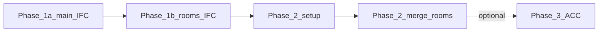

# Byggstyrning IFC tools

Automation for bringing **IFC collaboration deliverables** from **Archicad** (Graphisoft) into **Revit**: headless **Archicad IFC import** via Revit Batch Processor (BatchRvt) using the **Graphisoft IFC for Revit** stack (`OpenIFCDocument` + **CorrectIFCImport**), then model setup and room merge, and optional publish to Autodesk Construction Cloud (ACC). The orchestrator is [`powershell/Run-ByggPipelineSetup.ps1`](powershell/Run-ByggPipelineSetup.ps1); it implements the checklist *Uppdatera modell till Revit*.

## Pipeline phases

The launcher runs these steps in order (see the script `.SYNOPSIS` for parameters and skip flags):

1. **Phase 1a — Main Archicad IFC to RVT**  
   BatchRvt + [`scripts/rbp/setup/graphisoft_import_rbp.py`](scripts/rbp/setup/graphisoft_import_rbp.py) + **ByggstyrningIFCImporter** (`OpenIFCDocument` + Graphisoft **CorrectIFCImport**). This is the primary path for **IFC exported from Archicad**.  
   **Output:** main `.rvt`.

2. **Phase 1b — Rooms Archicad IFC to RVT**  
   - **Default:** BatchRvt + `xbim_rooms_import_rbp.py` + **ByggstyrningRoomImporter** (xBIM path).  
   - **Alternative:** `-RoomsImporter Graphisoft` — same Graphisoft **Archicad IFC** import as Phase 1a (`graphisoft_import_rbp.py`).  
   **Output:** rooms `.rvt`.

3. **Phase 2 — Two BatchRvt runs on the main model**  
   - **Run 1 —** [`setup_model_rbp.py`](scripts/rbp/setup/setup_model_rbp.py): purge IFC openings, worksets, rotate, True North, link Config template, acquire coordinates.  
   - **Run 2 —** [`merge_rooms_rbp.py`](scripts/rbp/merge_rooms/merge_rooms_rbp.py): open the rooms RVT, copy rooms and separation lines into the main model, then close the rooms model.

4. **Phase 3 (optional) — ACC publish**  
   When `-PublishAcc`: BatchRvt + [`publish_acc_rbp.py`](scripts/rbp/publish_acc/publish_acc_rbp.py) — `Document.SaveAsCloudModel` to ACC (requires hub / project / folder IDs as in script help).



## Repository layout

| Path | Role |
|------|------|
| `powershell/` | Orchestrator [`Run-ByggPipelineSetup.ps1`](powershell/Run-ByggPipelineSetup.ps1) and helper scripts |
| `scripts/rbp/` | RBP task scripts (`setup/`, `merge_rooms/`, `publish_acc/`) |
| `lib/` | Shared IronPython modules used by RBP tasks |
| `tools/` | C# Revit add-ins (e.g. ByggstyrningIFCImporter, ByggstyrningRoomImporter) |
| `docs/` | Runbooks and technical notes |
| `demo/` | Sample IFC inputs and demo outputs |
| `archive/` | Retired experiments and legacy scripts |
| `settings.json` | Paths and defaults (machine-specific; copy or adjust per workstation) |

## Quick start

From the **repository root**:

```powershell
.\powershell\Run-ByggPipelineSetup.ps1 `
  -MainIfcPath  "demo\in\A1_2b_BIM_XXX_0001_00.ifc" `
  -RoomsIfcPath "demo\in\A1_2b_BIM_XXX_0003_00.ifc" `
  -RevitYear 2025
```

Use `-RevitYear` to match your installed Revit. For a full example with explicit output paths, seed RVT, and prerequisites, see [`docs/README-pipeline.txt`](docs/README-pipeline.txt).

## C# add-ins — build, install, and releases

| Component | Role |
|-----------|------|
| **ByggstyrningIFCImporter** | Headless Graphisoft path: `OpenIFCDocument` + `CorrectIFCImport` (no Graphisoft UI). |
| **ByggstyrningRoomImporter** | xBIM-based rooms IFC import; loaded at runtime by BatchRvt / IronPython via `BYGG_XBIM_ROOMS_DLL`. |

**Prerequisites:** Windows, **Revit** (projects reference Revit API — edit `.csproj` HintPaths if you use another year), **.NET SDK** for **net48**. ByggstyrningIFCImporter needs Graphisoft **IFC Model Exchange with Archicad for Revit** (same year as Revit). ByggstyrningRoomImporter restores **Xbim.Essentials** via NuGet.

**Build** from the repository root:

```powershell
dotnet build "tools\ByggstyrningIFCImporter\ByggstyrningIFCImporter.csproj" -c Release
dotnet build "tools\ByggstyrningRoomImporter\ByggstyrningRoomImporter\ByggstyrningRoomImporter.csproj" -c Release
```

**Install (from source build):** copy `ByggstyrningIFCImporter.dll` and `ByggstyrningIFCImporter.addin` to `%APPDATA%\Autodesk\Revit\Addins\<year>\`. Deploy the room importer’s full `bin\Release` output; set `BYGG_XBIM_ROOMS_DLL` to the full path of `ByggstyrningRoomImporter.dll`. Prefer AppData over Program Files for unsigned builds (see `Deploy-ToProgramFiles.ps1`).

**GitHub Releases:** on a machine with Revit + Graphisoft, run `.\scripts\Package-Release.ps1 -RevitYear 2025`; outputs go to `dist/` as zip artifacts. GitHub-hosted runners do not include Revit; CI runs **xBIM unit tests** only.

## Further reading

- **[requirements.md](requirements.md)** — software, build, and runtime prerequisites  
- **[ByggstyrningIFCImporter on GitHub](https://github.com/byggstyrning/ByggstyrningIFCImporter)** — add-in source, CI, and GitHub Releases (IFC + room importers)  
- **[docs/README-pipeline.txt](docs/README-pipeline.txt)** — operator runbook (partial reruns, `RW_RESULT`, sidecars)  
- **[docs/empty-rvt-seed-README.txt](docs/empty-rvt-seed-README.txt)** — minimal seed `.rvt` for BatchRvt file list  
- **[tools/ByggstyrningIFCImporter/README.md](tools/ByggstyrningIFCImporter/README.md)** — build and deploy the main IFC importer add-in (copy also under `tools/`)  
- **[docs/graphisoft-revit-plugin-api-notes.md](docs/graphisoft-revit-plugin-api-notes.md)** — Graphisoft IFC for Revit API notes (Archicad import automation)

This repository is maintained for **Byggstyrning** (construction coordination) BIM workflows.

## License

See [LICENSE](LICENSE).
